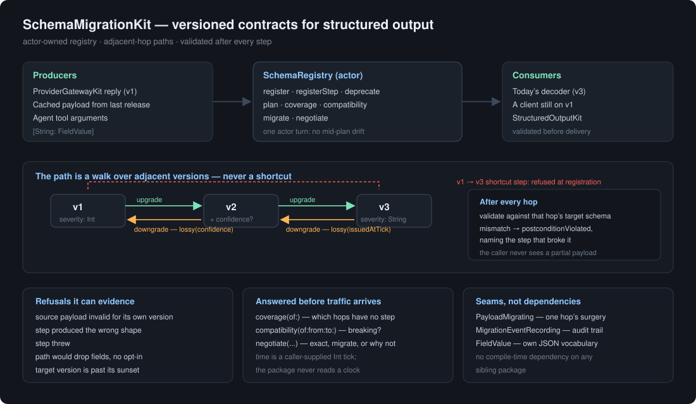
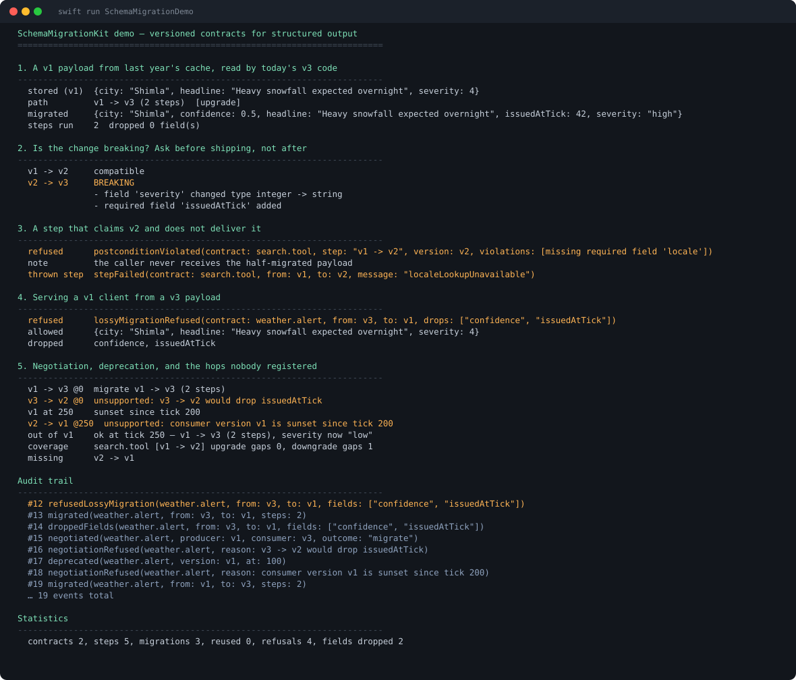

# SchemaMigrationKit

**Versioned contracts for LLM structured output — migrate a payload across schema versions, and prove it arrived.**

An actor-based, protocol-oriented Swift 6 package. It pairs with
[ProviderGatewayKit](https://github.com/rajatslakhina/foundation-model-provider-gateway)
(which produces the payloads) and
[StructuredOutputKit](https://github.com/rajatslakhina/structured-output-kit)
(which validates one payload against one schema), but depends on neither at
compile time.



## The problem

Ask a model for JSON and you eventually get JSON. Then you ship v2 of the app,
rename a field, and discover three things at once: the objects already sitting in
your cache are still v1, the tool arguments your agent emits are still v1, and
nothing in your stack knows that `severity` used to be an `Int`.

The 2026 literature is blunt about this. Structured outputs have become the
default contract between an app and a model, which means **a breaking schema
change is a breaking API change** — and tool-contract drift is now cited as the
single largest source of production agent failures. The recommended practice is
to record a `schema_version` on every payload and keep migration paths between
versions.

Recording the version is the easy half. The hard half is what happens next:

- A dictionary of `[v1: closure, v2: closure]` will happily hand you a "v3"
  object that is missing a field v3 requires. You find out three layers later,
  as a decode error with no idea which hop broke it.
- Going *backwards* — serving a v1 client from a v3 payload — silently drops
  whatever v1 never had a slot for. The client cannot tell it received half a
  payload.
- Nobody can answer "is there a step for every hop?" until production traffic
  asks.

`SchemaMigrationKit` is the layer that owns all three.

## What it guarantees

**1. Every hop is verified against the schema it promised.**
After each step, the result is validated against that step's target version. A
step that claims to produce v2 and forgets a field v2 requires fails *at that
step*, named:

```
postconditionViolated(contract: search.tool, step: "v1 -> v2", version: v2,
                      violations: [missing required field 'locale'])
```

The caller never receives the half-migrated payload. This is the difference
between a migration layer and a dictionary of closures.

**2. The source payload is checked before anything runs.**
Migrating garbage produces garbage that merely looks migrated. A payload that
does not satisfy the version it claims is refused up front.

**3. Loss is declared, and refused by default.**
A step says what it discards (`.lossy(drops: ["issuedAtTick"])`). A path that
would drop anything is refused unless the caller passes `allowingLoss: true`,
and the dropped fields land in the audit trail. Serving a stale client a payload
it cannot tell is incomplete is worse than refusing.

**4. No shortcut edges.**
Paths walk *adjacent* registered versions. A `v1 -> v3` step is refused at
registration, because it would let a v1 payload reach v3 without ever being
checked against v2 — exactly the silent drift the package exists to prevent.

**5. Gaps are visible before traffic arrives.**
`coverage(of:)` reports which hops have no step, in both directions:

```
weather.alert [v1 -> v2 -> v3] upgrade gaps 1, downgrade gaps 2
```

**6. Deprecation is a first-class state, and asymmetric.**
A version past its sunset tick is refused as a migration *target* while
migrating *away* from it still works — which is the whole point of sunsetting.
Time is a caller-supplied `Int` tick; the package never reads a clock, so the
boundary is asserted exactly, with no sleeps anywhere in the suite.

## Compatibility classification

`compatibility(of:from:to:)` diffs two versions and tells you whether the change
breaks an existing reader, before you ship it:

```
v1 -> v2     compatible
v2 -> v3     BREAKING
             - field 'severity' changed type integer -> string
             - required field 'issuedAtTick' added
```

Unknown fields are ignored rather than reported. The must-ignore-unknown rule is
what lets a v2 producer talk to a v1 consumer at all; a layer that rejected them
would make every additive change breaking.

## Negotiation

When a producer emits one version and a consumer wants another,
`negotiate(_:producerVersion:consumerVersion:at:)` returns `.exact`,
`.migrate(path)`, or `.unsupported(reason)` — and it will not offer a lossy path
as an automatic answer.

## Installation

```swift
.package(url: "https://github.com/rajatslakhina/schema-migration-kit.git", from: "1.0.0")
```

```swift
.product(name: "SchemaMigrationKit", package: "schema-migration-kit")
```

## Usage

```swift
let registry = SchemaRegistry(recorder: InMemoryMigrationEventRecorder())

try await registry.register(
    ContractDefinition(
        id: "weather.alert",
        versions: [
            ContractVersionDefinition(version: 1, schema: v1),
            ContractVersionDefinition(version: 2, schema: v2),
            ContractVersionDefinition(version: 3, schema: v3)
        ]
    )
)

try await registry.registerStep(
    PayloadMigration(from: 1, to: 2) { payload in
        var next = payload
        next["confidence"] = .double(0.5)
        return next
    },
    for: "weather.alert"
)

let result = try await registry.migrate(
    cachedPayload,
    of: "weather.alert",
    from: 1,
    to: 3
)
// result.payload has been validated against v3 before you see it
```

Going the other way, opt in to the loss explicitly:

```swift
let forOldClient = try await registry.migrate(
    current, of: "weather.alert", from: 3, to: 1, allowingLoss: true
)
forOldClient.droppedFields   // ["confidence", "issuedAtTick"]
```

## Demo

```bash
swift run SchemaMigrationDemo
```

Five scenarios on real captured output — a two-hop upgrade of a cached v1
payload, compatibility classification, a lying step and a throwing step both
caught, a lossy downgrade refused then allowed, and negotiation across a sunset
boundary.



## Interop

`FieldValue` is the package's own JSON-shaped vocabulary, so there is no
compile-time dependency on any sibling package — bridging from
`StructuredOutputKit`'s `JSONValue` is one adapter. `MigrationEventRecording` is
a seam, so the audit trail can be forwarded to
[TraceKit](https://github.com/rajatslakhina/trace-kit) or any other pipeline.

## Quality

| Gate | Result |
|------|--------|
| `swift build` | 0 warnings, 0 errors |
| `swift test` | 73 tests, 0 failures |
| `llvm-cov` line coverage | **100.00%** (662/662) |
| `llvm-cov` region coverage | **100.00%** (313/313) |
| `llvm-cov` function coverage | **100.00%** (129/129) |
| `swiftlint lint --strict` | 0 violations, 34 files (SwiftLint 0.63.2, tool-verified) |

`MigrationError.swift` and `MigrationEventRecording.swift` are pure declarations
with no executable regions and are correctly omitted by llvm-cov.

## Licence

MIT — see [LICENSE](LICENSE).
